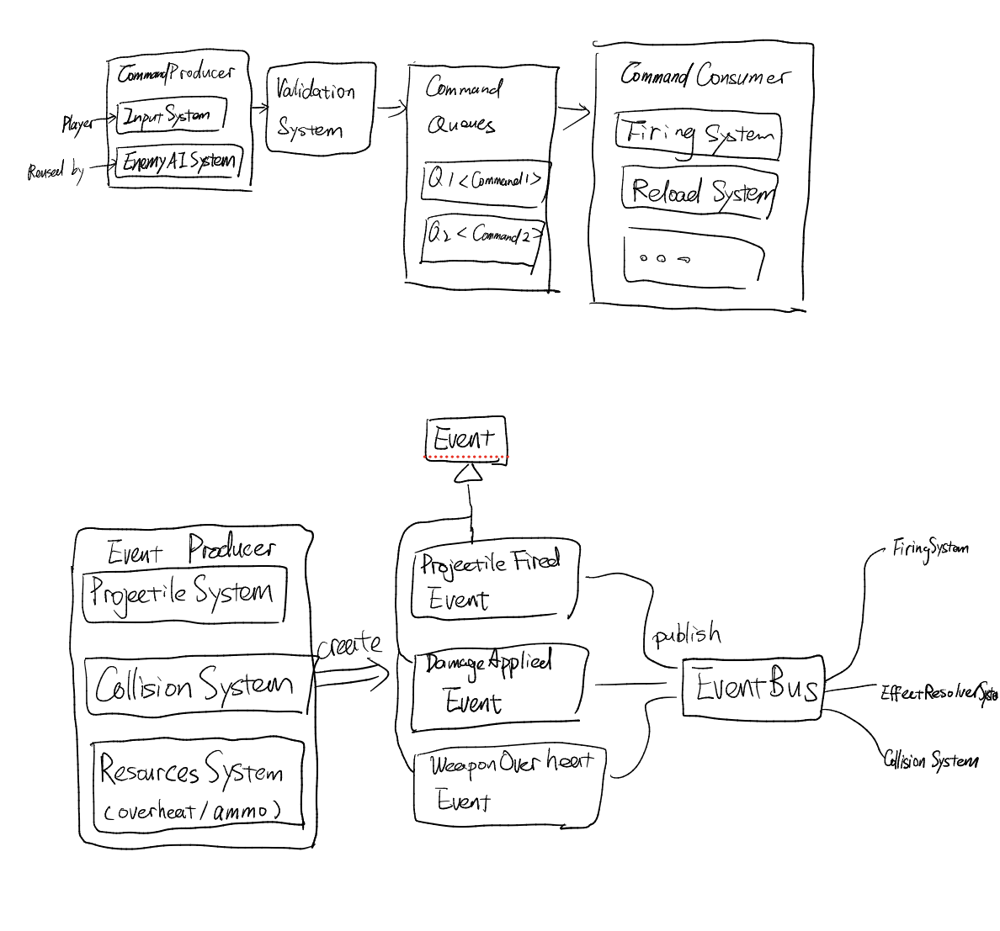

## Patterns

### Command pattern
Encapsulate a request as an object, allowing queueing, validation, cancellation, and replay independently of execution.

> Used in `FireCommand`,`ReloadCommand`, ..., `CommandQueue`, `CommandValidationSystem`, `CancelCommand`, `CommandQueues`

`CommandQueues` store all `CommandQueue` instances, which are queues of one specific typed `Command` structs (e.g. `FireCommand`, `ReloadCommand`).

We plan to have the following commands for player actions:
| Command | Description |
|---|---|
| `FireCommand` | Emitted on trigger pull. FiringSystem is the primary consumer. BurstFireComponent generates synthetic FireCommands for subsequent shots within a burst. |
| `ReloadCommand` | Triggers the reload in ReloadSystem. Auto-emitted by ResourceSystem when ammo hits 0 if auto-reload is enabled. |
| `SwitchWeaponCommand` | Swaps active weapon slot. SwitchWeaponSystem cancels in-flight bursts and enforces per-slot cooldowns. |
| `CancelCommand` | Cancels a pending command before it is consumed. Useful for interrupting reloads on dodge roll. |
| `AimCommand` | Updates aim direction, stored in AimStateComponent. Read by FiringSystem at fire time. |

See  for a visual of how these commands flow through the systems and also the event bus as below.

Every player or AI action (`Command`) becomes a typed struct pushed onto the `CommandQueue` of its own. This decouples the input layer from the execution layer completely. e.g. the AI does not call FiringSystem.fire(), it pushes a FireCommand. 

CommandValidationSystem acts as the guard, so no execution system ever needs to check ammo, mana, or cooldowns itself. 

CancelCommand lets you abort queued actions (e.g. cancel a reload on dodge roll) without touching the reload state machine. We use similar concept as `Optional` in Java to mark a command as cancelled without removing it from the queue, so the state machine can still see the cancelled command and reset to idle instead of trying to execute it and failing due to missing resources.

### Observer pattern

> Used in `EventBus`, `ProjectileFiredEvent`, `DamageAppliedEvent`, ...

We have Event Bus to handle one-to-many dependency so systems never call each other directly. 

e.g. FiringSystem publishes ProjectileFiredEvent; ResourceSystem, AnimSystem, and AudioSystem all subscribe independently. 

Adding a new subscriber (e.g. AchievementSystem listening for WeaponBrokenEvent) requires zero changes to existing systems.

